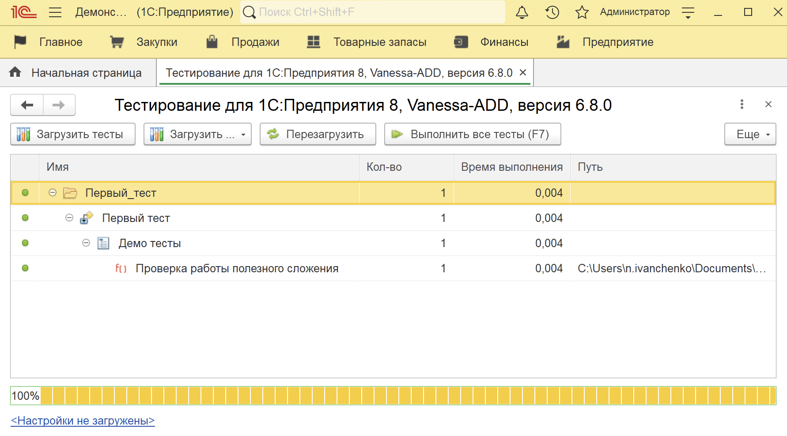
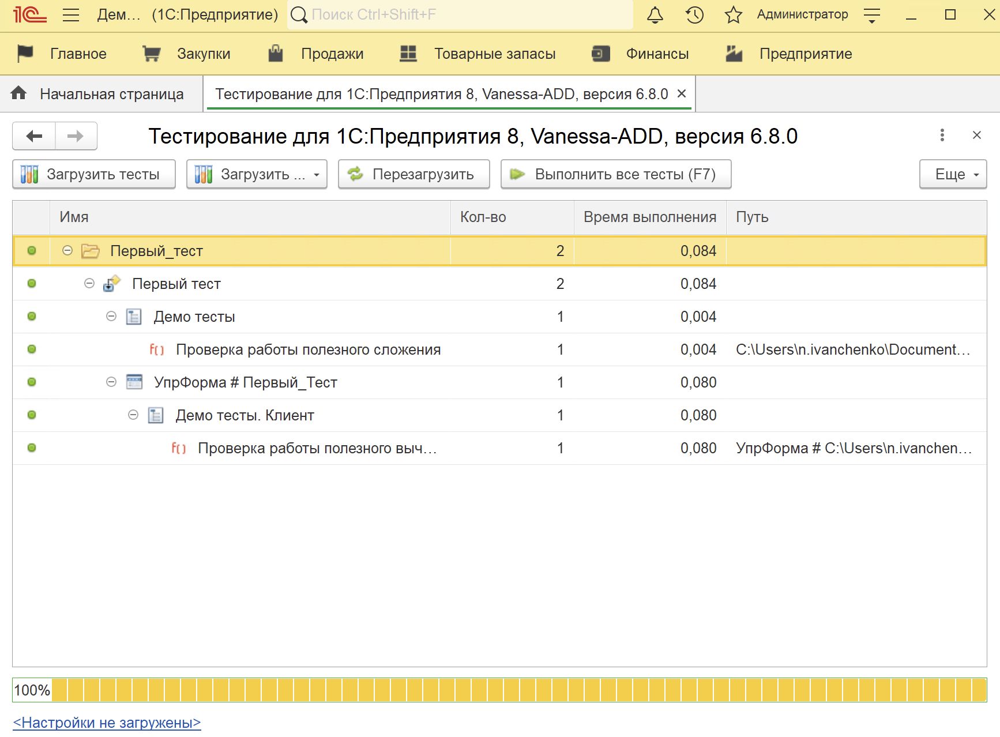

# Отправная точка в применении автоматического тестирования на платформе 1С

Многие слышали про то, что в 1С есть разный набор инструментов для тестирования. И в мире 1С, разработчики расходятся по разным монастырям. Одни считают, что тестирование не нужно и оно только увеличивает себестоимость разработки, и мол заказчик не готов за это платить, нужно сразу писать код хорошо. Другие считают, что без тестов всё сразу превратится в тыквы, и покрывают тестами все строчки кода, пытаются довести счетчик покрытия до 100%. Так же есть и те разработчики, которые все могут, но им просто лень. 

В данной статье я хочу обратится к тем, кто хотел бы начать применять в своей жизни авто-тесты, но не знает с чего начать. Да это статья для новичков, в которой я покажу путь, с которого можно начать путешествие, и в конце концов выбрать свой монастырь.

В начале я немного пофилософствую, и выражу своё мнение на текущий момент, потом расскажу про один из инструментов и покажу несколько приемов, которые могут облегчить вашу жизнь на этом пути.

## Философия. 

Бытует мнение, что писать тесты долго, лениво, бессмысленно и т.д. У каждого своя правда. Но расскажу и свою. Для примера пофантазируем, что перед нами задача, взять документ, например "Реализация товаров" и доработать, добавив какое-нибудь поведение в проведение документа. Движения в новый регистр, пересчет суммы или неважно что еще. Как бы многие поступили в такой ситуации? Алгоритм действий пример такой:

1. Добавили метаданных / написали код
2. Запустили предприятие
3. Открыли список реализаций
4. Нашли документ который удовлетворяет условиям доработки/ создали новый
5. Открыли документ
6. Провели документ
7. Вспомнили, что нужно в обработке проведения поставить точку остановы. Поставили.
8. Опять открыли документ, провели.
9. Остановились на нужной точке.
10. Проверили поведение системы
11. Проверили в отчете о проводках, что поведение корректное.
12. Убедились, что часть кода ведет себя так, как мы хотели. Идем в п 1.

Кто-нибудь узнал тут себя? Хорошо, кто сможет ответить, сколько будет итераций по п 2 - 12 ? А сколько времени в итоге займет вот этот поиск, открытие, проведение документа, отладка, просмотр отчета? Если задача была скажем, на 3 часа(да мы многие любим измерять в часах задачи). Сколько из них ушло на вот эту рутину проверки?

А сколько времени уйдет на написание кода который:

1. Получит объект документ(найдет шаблон, сгенерит новый)
2. Выполнит запись с проведением
3. Запросом выдернет поводки документа и сравнит с ожидаемым результатом?

Предположу что, в самом худшем варианте, столько же. Но как правило, значительно меньше.

Забегая вперед скажу, что как только вы начнете на регулярной основе писать тесты, вы поймете, что какой-то код тестировать проще и удобнее, а какой-то очень тяжело. И при разработке вы эту мысль уже никогда не отпустите, и будете писать код, который протестировать будет проще. И потом выяснится, что код стал, чище, более декомпозированый, и просто хорошо пахнет.

## Суть без инструментария

Прежде чем мы пойдем разбираться, с какого инструмента начать тестировать, давайте попробуем понять, а что это вообще такое, написание тестов. Я не буду привязываться к какой-то конфигурации или бизнес логике. Представим, что вот есть у нас ```ПолезныйОбщийМодуль```, в котором есть не менее полезная функция:

```bsl
Функция ПолезноеСложение(Параметр1, Параметр2) Экспорт 

	Результат = Параметр1 + Параметр2;
	
	Возврат Результат;	

КонецФункции 
```

Как бы мы могли эту функцию проверить, если бы у нас не было никаких инструментов для тестирования.

Правильно, можно написать внешнюю обработку, которая бы вызывала эту функцию. И выглядел бы модуль формы примерно вот так:

```bsl
&НаСервереБезКонтекста
Процедура КомандаПроверитьФункциюНаСервере()
	
	Параметр1 = 3;
	Параметр2 = 2;
	
	Результат = ПолезныйОбщийМодуль.ПолезноеСложение(Параметр1, Параметр2);
	
	Если НЕ Результат = 5 Тогда
		ВызватьИсключение "Результат полезного сложения не корректный";		
	КонецЕсли;
	
КонецПроцедуры

&НаКлиенте
Процедура КомандаПроверитьФункцию(Команда)
	КомандаПроверитьФункциюНаСервере();
КонецПроцедуры
```

И это чудесно, теперь с нами навсегда есть код, на родном 1С. Который проверяет поведение кода. Мы всегда можем открыть обработку, нажать кнопку и узнать как у нас работает функция. Даже спустя годы, обновления, доработки. Мы всегда можем просто открыть и проверить.

А если в ходе тестов у вас будут создаваться справочники, документы, записи регистров. То при частом запуске база начнет заполняться мусором от тестов. Тогда вы решите, что можно перед запуском теста открывать транзакцию, а после теста ее отменять. Тогда все данные, которые были изменены во время теста будут отменены. Еще одно чудо.

Но рано или поздно, при таком подходе, вы начнете обрастать повторяемым кодом, который будете объединять в модули. Но этого делать ну нужно, все уже придумано до нас. И так.

## Инструмент.

В данной статье разговор будет идти про [Vanessa-ADD](https://github.com/vanessa-opensource/add). А если быть точным про его механизм юнит-тестирования.

По сути, это набор внешних обработок, который поможет вам быстрее и меньшим кодом писать тесты. Так же в нем есть механизмы по автоматическому запуску. (например батник, который сам запустит 1С, загрузит все ваши тесты из каталога, запустит и сложит результат куда вы захотите).

И так если мы хотим сейчас просто начать писать тесты, можно просто скачать архив из [релизов](https://github.com/vanessa-opensource/add/releases) на гитхабе. А если вы в дальнейшем решите, что нужно тесты запускать каждую пятницу по расписанию, то нужно установить среду исполнения [OneScript](https://oscript.io/downloads) И выполнить команду в консоли ОС

```
opm install add
```

Быстро скажу ```opm``` - это одна из утилит, которая будет установлена вместе с OneScript. Эта утилита помогает управлять библиотеками OneScript. А ключи ```install add``` запускают процесс установки библиотеки add. После выполнения команды в каталоге, где установлен OneScript, будет каталог ```lib/add```. В этом каталоге почти аналогичный набор инструментов, который вы скачали бы со страницы [релизов](https://github.com/vanessa-opensource/add/releases).

## Первый тест

Давайте повторим предыдущий тест, но уже используя Vanessa-ADD. Создадим новую внешнюю обработку, отложим ее в отдельный каталог. И в модуль объекта вставим следующее:

```bsl
Перем КонтекстЯдра;
Перем Ожидаем;

Процедура Инициализация(КонтекстЯдраПараметр) Экспорт
	КонтекстЯдра = КонтекстЯдраПараметр;
	Ожидаем = КонтекстЯдра.Плагин("УтвержденияBDD");
КонецПроцедуры

Процедура ЗаполнитьНаборТестов(НаборТестов, КонтекстЯдраПараметр) Экспорт
	
	НаборТестов.НачатьГруппу("Демо тесты");
 	НаборТестов.Добавить("ТестДолжен_ПроверитьРаботуПолезногоСложения", , "Проверка работы полезного сложения"); 
	
КонецПроцедуры

Процедура ТестДолжен_ПроверитьРаботуПолезногоСложения() Экспорт
	
	Параметр1 = 3;
	Параметр2 = 2;
	
	Результат = ПолезныйОбщийМодуль.ПолезноеСложение(Параметр1, Параметр2);
	
	Ожидаем.Что(Результат, "Результат полезного сложения корректен").Равно(5);
	
КонецПроцедуры
```

В данном коде много непонятного, но мы постепенно разберемся, что это все значит.

А теперь запустим предприятие, и откроем обработку ```Каталог_Vanessa_add/xddTestRunner.epf```. Данная обработка позволяет много чего полезного, в том числе запускать тесты и просматривать результат выполнения.

Открыв обработку, запустим команду "Загрузить тесты", и выберем каталог, где мы сохранили обработку с тестом.



Из каталога, в дерево тестов будут загружены все обработки с тестами, которы можно запускать. Запустим выбранный тест, и убедимся что он работает. Особенно пытливые могут на этом этапе сломать функцию, или ожидать другой результат в тесте. Что бы посмотреть как он упадет.

## Про кишки

В коде обработки сейчас много неизвестной магии. Я попробую объяснить, что это все значит, и доказать что это всего лишь комбинация внешних обработок. Ничего нового, и не понятного простому 1С разработчику тут нет.

Сразу оговорюсь, что тесты можно запускать как в контексте ```&НаСервере``` так и ```&НаКлиенте```. Этот пример про тестирование серверного метода. Далее мы рассмотрим вариант тестирования клиентского метода.

Теперь по порядку. 

* В самом начале у нас объявляется две переменные, они очень важные, в них позже будут помещены очень полезные объекты.

* Процедура Инициализация(КонтекстЯдраПараметр). В этой процедуре происходит инициализация всех необходимых значений. Тут так же можно дополнить своей логикой, которая отрабатывает при загрузке ваших тестов. В параметр КонтекстЯдраПараметр передается Объект обработки ```Каталог_Vanessa_add/xddTestRunner.epf```который мы с вами открыли. Тут же происходит загрузка плагинов. Про плагины мы с вами поговорим чуть ниже, даже сделаем свой.

* Процедура ЗаполнитьНаборТестов(НаборТестов, КонтекстЯдраПараметр). Эта процедура отвечает за добавление тестов в дерево. Тут так же доступен КонтекстЯдраПараметр. Тут в набор тестов можно добавлять как имена процедур тестов, так и группы(папки) для удобства.

* Ну и дальше можно писать процедуры, которые будут выполнять тесты. Имена этих процедур нужно  добавить в НаборТестов.

Так же в модуль можно добавить две процедуры, например вот с таким содержанием.

```bsl
Процедура ПередЗапускомТеста() Экспорт
	НачатьТранзакцию();
КонецПроцедуры

Процедура ПослеЗапускаТеста() Экспорт
	Если ТранзакцияАктивна() Тогда
	    ОтменитьТранзакцию();
	КонецЕсли;
КонецПроцедуры
```

Эти процедуры будут выполнять перед и после каждого теста. В данном примере мы начинаем транзакцию перед тестом, и отменяем после. Таким трюком, мы откатываем все изменения, которые внесены в базу при работе теста.

Теперь про клиент. Давайте у нашей обработки с тестом, добавим форму, и в ней напишем следующий код:

```bsl
&НаКлиенте
Перем КонтекстЯдра;
&НаКлиенте
Перем Ожидаем;

&НаКлиенте
Процедура Инициализация(КонтекстЯдраПараметр) Экспорт
	КонтекстЯдра = КонтекстЯдраПараметр;
	Ожидаем = КонтекстЯдра.Плагин("УтвержденияBDD");         
КонецПроцедуры

&НаКлиенте
Процедура ЗаполнитьНаборТестов(НаборТестов, КонтекстЯдраПараметр) Экспорт
	КонтекстЯдра = КонтекстЯдраПараметр;
	
	НаборТестов.НачатьГруппу("Демо тесты. Клиент");
	
	НаборТестов.Добавить("ТестДолжен_ПроверитьРаботуПолезногоВычитания", , "Проверка работы полезного вычитания");
	
КонецПроцедуры

&НаКлиенте
Процедура ТестДолжен_ПроверитьРаботуПолезногоВычитания() Экспорт
	
	Параметр1 = 7;
	Параметр2 = 2;
	
	Результат = ПолезныйОбщийМодульКлиент.ПолезноеВычитание(Параметр1, Параметр2);
	
	Ожидаем.Что(Результат, "Результат полезного сложения корректен").Равно(5);
КонецПроцедуры

 
&НаКлиенте
Процедура ПередЗапускомТеста() Экспорт
	// код до теста		
КонецПроцедуры  

&НаКлиенте
Процедура ПослеЗапускаТеста() Экспорт
	// код после теста	
КонецПроцедуры
```

И тут логика аналогичная. Только ```&НаКлиенте```. И вместо объектов обработок, в параметры передаются формы этих обработок. 



## Проверка значений

Вы скорее всего заметили вот такую строку

```bsl
Ожидаем.Что(Результат, "Результат полезного сложения корректен").Равно(5)
```

А сама переменная ```Ожидаем``` инициализируется каким-то плагином. На самом деле любой плагин - это такая же внешняя обработка которая подключается самой Vanessa-ADD. И ее код можно посмотреть и изучить. Все плагины лежат в каталоге ```Каталог_Vanessa_add/plugins```. Их там достаточно, и они предоставляют набор удобных инструментов. Очень полезно их посмотреть. Помимо обработки УтвержденияBDD, еще есть БазовыеУтверждения. Можно использовать вот так

```bsl
Перем КонтекстЯдра;
Перем Утверждения;

Процедура Инициализация(КонтекстЯдраПараметр) Экспорт
	КонтекстЯдра = КонтекстЯдраПараметр;
	Утверждения = КонтекстЯдра.Плагин("БазовыеУтверждения"); // <-- Другой плагин
КонецПроцедуры

Процедура ЗаполнитьНаборТестов(НаборТестов, КонтекстЯдраПараметр) Экспорт
	
	НаборТестов.НачатьГруппу("Демо тесты");
 	НаборТестов.Добавить("ТестДолжен_ПроверитьРаботуПолезногоСложения", , "Проверка работы полезного сложения"); 
	
КонецПроцедуры

Процедура ТестДолжен_ПроверитьРаботуПолезногоСложения() Экспорт
	
	Параметр1 = 3;
	Параметр2 = 2;
	
	Результат = ПолезныйОбщийМодуль.ПолезноеСложение(Параметр1, Параметр2);
	
	Утверждения.ПроверитьРавенство(Результат, 5, "Результат полезного сложения корректен");
	
КонецПроцедуры
```

Но лично мне больше нравятся текучие утверждения УтвержденияBDD.

## Шаблон теста

Для удобства у меня есть пустая обработка шаблон, которую я копирую, и делаю новый тест.

Модуль объекта такой обработки выглядит вот так

```bsl
Перем КонтекстЯдра;
Перем Ожидаем;

Процедура Инициализация(КонтекстЯдраПараметр) Экспорт
	КонтекстЯдра = КонтекстЯдраПараметр;
	Ожидаем = КонтекстЯдра.Плагин("УтвержденияBDD");
КонецПроцедуры

Процедура ЗаполнитьНаборТестов(НаборТестов, КонтекстЯдраПараметр) Экспорт
  КонтекстЯдра = КонтекстЯдраПараметр;
  //НаборТестов.НачатьГруппу("Тесты. Сервер");
  //НаборТестов.Добавить("ТестДолжен_ПроверитьРаботуКодаНаСервере", , "Проверка работы на сервере");
КонецПроцедуры

Процедура ТестДолжен_ПроверитьРаботуКодаНаСервере() Экспорт
	
	ТестовыеДанные = 1;
	
	Ожидаем.Что(ТестовыеДанные, "Тестовые данные = 1").Равно(1);
	
КонецПроцедуры

Процедура ПередЗапускомТеста() Экспорт
	НачатьТранзакцию();
КонецПроцедуры

Процедура ПослеЗапускаТеста() Экспорт
	Если ТранзакцияАктивна() Тогда
	    ОтменитьТранзакцию();
	КонецЕсли;
КонецПроцедуры
```

и модуль формы:

```bsl
&НаКлиенте
Перем КонтекстЯдра;
&НаКлиенте
Перем Ожидаем;

&НаКлиенте
Процедура Инициализация(КонтекстЯдраПараметр) Экспорт
	КонтекстЯдра = КонтекстЯдраПараметр;
	Ожидаем = КонтекстЯдра.Плагин("УтвержденияBDD");
	СтроковыеУтилиты = КонтекстЯдра.Плагин("СтроковыеУтилиты");
КонецПроцедуры

&НаКлиенте
Процедура ЗаполнитьНаборТестов(НаборТестов, КонтекстЯдраПараметр) Экспорт
	КонтекстЯдра = КонтекстЯдраПараметр;
	
	//НаборТестов.НачатьГруппу("Тесты. Клиент", Ложь);
	//
	//НаборТестов.Добавить("ТестДолжен_ПроверитьРаботуКодаНаКлиенте", , "Проверка работы на клиенте");
	
КонецПроцедуры

&НаКлиенте
Процедура ТестДолжен_ПроверитьРаботуКодаНаКлиенте() Экспорт
	
	ТестовыеДанные = 1;
	
	Ожидаем.Что(ТестовыеДанные, "Тестовые данные = 1").Равно(1);
	
КонецПроцедуры
 
&НаКлиенте
Процедура ПередЗапускомТеста() Экспорт
			
КонецПроцедуры  

&НаКлиенте
Процедура ПослеЗапускаТеста() Экспорт
	
КонецПроцедуры
```

## Сделаем свой плагин

Для закрепления понимания, сделаем свой плагин. Бессмысленный и беспощадный. Предположим у нас есть много тестов, которые очень часто должны для тестов сгенерировать справочник товаров. Сделаем плагин, который будем использовать как общий модуль для всех тестов, который будет генерировать элемент справочника.

Создадим в каталоге плагинов новую обработку ```Каталог_Vanessa_add/plugins/ГенераторТоваров.epf```. Вся хитрость добавления плагина в правильной реализации интерфейса подключения.

Вот модуль формы плагина:

```bsl
&НаКлиенте
Перем ПутьКФайлуПолный Экспорт;

&НаКлиенте
Перем КонтекстЯдра;


// { Plugin interface
&НаКлиенте
Функция ОписаниеПлагина(КонтекстЯдра, ВозможныеТипыПлагинов) Экспорт
	Возврат ОписаниеПлагинаНаСервере(ВозможныеТипыПлагинов);
КонецФункции

&НаКлиенте
Процедура Инициализация(КонтекстЯдраПараметр) Экспорт
	КонтекстЯдра = КонтекстЯдраПараметр;
КонецПроцедуры

&НаСервере
Функция ОписаниеПлагинаНаСервере(ВозможныеТипыПлагинов)
	КонтекстЯдраНаСервере = ВнешниеОбработки.Создать("xddTestRunner");
	Возврат ЭтотОбъектНаСервере().ОписаниеПлагина(КонтекстЯдраНаСервере, ВозможныеТипыПлагинов);
КонецФункции
// } Plugin interface

// { Helpers
&НаСервере
Функция ЭтотОбъектНаСервере()
	Возврат РеквизитФормыВЗначение("Объект");
КонецФункции

// } Helpers
```

И модуль объекта:

```bsl
Перем ПутьКФайлуПолный Экспорт;// в эту переменную будет установлен правильный клиентский путь к текущему файлу

Перем КонтекстЯдра;

// { Plugin interface
Функция ОписаниеПлагина(КонтекстЯдра, ВозможныеТипыПлагинов) Экспорт
	Результат = Новый Структура;
	Результат.Вставить("Тип", ВозможныеТипыПлагинов.Утилита);
	Результат.Вставить("Идентификатор", Метаданные().Имя);
	Результат.Вставить("Представление", "Генератор товаров");
	
	Возврат Новый ФиксированнаяСтруктура(Результат);
КонецФункции

Процедура Инициализация(КонтекстЯдраПараметр) Экспорт
	КонтекстЯдра = КонтекстЯдраПараметр;
КонецПроцедуры
// } Plugin interface

Функция СоздатьЭлементТоваров(Наименование) Экспорт 

	НовыйТовар = Справочники.Товары.СоздатьЭлемент();               
	
	НовыйТовар.Наименование = Наименование;
	НовыйТовар.Вид = Перечисления.ВидыТоваров.Товар;
	
	НовыйТовар.Записать();
	
	Возврат НовыйТовар.Ссылка;

КонецФункции // СоздатьЭлементТоваров()
```

Плагин готов, теперь давайте его проверим. Создадим новую обработку из шаблона и вот такой у нее будет модуль объекта.

```bsl
Перем КонтекстЯдра;
Перем Ожидаем; 
Перем ГенераторТоваров; // Объявим генератор товаров

Процедура Инициализация(КонтекстЯдраПараметр) Экспорт
	КонтекстЯдра = КонтекстЯдраПараметр;
	Ожидаем = КонтекстЯдра.Плагин("УтвержденияBDD"); 
	ГенераторТоваров = КонтекстЯдра.Плагин("ГенераторТоваров"); // подключим плагин с генератором товаров
КонецПроцедуры

Процедура ЗаполнитьНаборТестов(НаборТестов, КонтекстЯдраПараметр) Экспорт
	КонтекстЯдра = КонтекстЯдраПараметр;
	НаборТестов.НачатьГруппу("Мой плагин");
	НаборТестов.Добавить("ТестДолжен_ПроверитьРаботуПлагинаПоСозданиюТоваров", , "Проверка работы плагина создания товаров");
КонецПроцедуры

Процедура ТестДолжен_ПроверитьРаботуПлагинаПоСозданиюТоваров() Экспорт
	
	// Дано
	Наименование = "Моя тестовая номенклатура";
	
	// Когда
	НоваяНоменклатура = ГенераторТоваров.СоздатьЭлементТоваров(Наименование); // вызовем генератор товаров
	
	Запрос = Новый Запрос;
	Запрос.УстановитьПараметр("ИмяНоменклатуры", Наименование);
	Запрос.Текст = "ВЫБРАТЬ
	               |	Товары.Ссылка КАК Ссылка
	               |ИЗ
	               |	Справочник.Товары КАК Товары
	               |ГДЕ
	               |	Товары.Наименование = &ИмяНоменклатуры";  
	РезультатЗапроса = Запрос.Выполнить();
	
	// Тогда	
	Ожидаем.Что(НоваяНоменклатура, "Новая номенклатура имеет тип").ИмеетТип(Тип("СправочникСсылка.Товары"));
	Ожидаем.Что(НоваяНоменклатура, "Новая номенклатура не пустая ссылка").Не_().Равно(Справочники.Товары.ПустаяСсылка());
	Ожидаем.Что(РезультатЗапроса.Пустой(), "Результат запроса не пустой").Равно(Ложь);
	
КонецПроцедуры

Процедура ПередЗапускомТеста() Экспорт
	НачатьТранзакцию();
КонецПроцедуры

Процедура ПослеЗапускаТеста() Экспорт
	Если ТранзакцияАктивна() Тогда
	    ОтменитьТранзакцию();
	КонецЕсли;
КонецПроцедуры
```

Запустим тесты, и убедимся что наш плагин работает, и мы поняли как устроены тесты в общем.

Аналогично, для контекста клиента. Если у формы плагина сделать экспортные методы, и подключив плагин на клиенте, можно вызывать эти методы.

## Про оформление

Как вы заметили в последнем тесте я разделил его на три условные блока Дано, Когда и Тогда. Это не обязательно, но это из подходов, где в тесте мы сначала определяем какие либо значения, потом выполняем действия и проверяем результат. Такое можете часто встретить в чужих тестах. Хорошим тоном придерживаться такой структуры.

# Всякие лайфхаки и хитрости.

Ниже я поделюсь некоторыми хитростями, которые помогут в тестировании.

## Дополнительные данные для выполнения тестов.

Некоторые тестируемые методы требуют дополнительных данных/файлов для выполнения. Например загрузка из таблиц эксель, где метод на вход получает таблицу эксель как двоичные данные или путь до файла. Вариантов решения этой проблемы много, я перечислю несколько.

1. Положить в общую папку тестовые данные и читать их оттуда. Очень простой вариант, но вылезают всякие минусы. Тесты привязаны к определенным путям, и если наша база в клиент-серверной архитектуре, файлы должны быть доступны и с сервера. Это порождает сложности, например запустить тесты на другом сервере, или ноутбуке разработчика.

2. Положить файлы в макет самой обработки тестирования, из доставать из макета в самой процедуре теста.

3. Более экзотичный метод, который иногда наиболее удобный, держать необходимые файлы рядом со обработкой и скачивать их на сервер при загрузке тестов. 

Третий вариант может показаться самым не понятным, его мы и разберем. Пофантазируем что у нас есть метод который на основании json сообщения формирует новый товар. 

Создадим новый тест, и модуль формы будет вот такой

```bsl
&НаКлиенте
Перем КонтекстЯдра;

&НаКлиенте
Перем ПутьКФайлуПолный Экспорт;

&НаКлиенте
Процедура Инициализация(КонтекстЯдраПараметр) Экспорт
	КонтекстЯдра = КонтекстЯдраПараметр;                    
КонецПроцедуры

&НаКлиенте
Процедура ЗаполнитьНаборТестов(НаборТестов, КонтекстЯдраПараметр) Экспорт
    // Эта процедура всегда выполняется при загрузке теста и на клиенте
    // Тогда мы в этой процедуре скачать нужный нам файл, который лежит рядом с тестом, и положим его во временный каталог на сервере.
	ФайлДжсон = СтрЗаменить(ПутьКФайлуПолный, "ЗагрузкаТовараИзДжсон.epf", "data.json");
	ОтправитьФайлНаСервер("data.json", ФайлДжсон);
КонецПроцедуры  

&НаКлиенте
Асинх Процедура ОтправитьФайлНаСервер(ИмяНаСервере, Путь) Экспорт 

	Обещание = НайтиФайлыАсинх(Путь, , Ложь);
	Файлы = Ждать Обещание;

	ДобавляемыеФайлы = Новый Массив;

    ОписаниеДобавляемогоФайла = Новый ОписаниеПередаваемогоФайла;
    ОписаниеДобавляемогоФайла.Имя = Файлы[0].ПолноеИмя;
    ДобавляемыеФайлы.Добавить(ОписаниеДобавляемогоФайла);

	Обещание = ПоместитьФайлыНаСерверАсинх(,,ДобавляемыеФайлы, ЭтаФорма.УникальныйИдентификатор);    
	Результат = Ждать Обещание;
	
	ЗаписатьФайлНаСервере(ИмяНаСервере, Результат[0].Адрес);
	
КонецПроцедуры

&НаСервере
Процедура ЗаписатьФайлНаСервере(ИмяНаСервере, АдресВХ)

	Файл = КаталогВременныхФайлов() + ПолучитьРазделительПути() + ИмяНаСервере;
	ПолучитьИзВременногоХранилища(АдресВХ).Записать(Файл);

КонецПроцедуры
```

А модуль объекта теста сделаем вот таким

```bsl
Перем КонтекстЯдра;
Перем Ожидаем;

Процедура Инициализация(КонтекстЯдраПараметр) Экспорт
	КонтекстЯдра = КонтекстЯдраПараметр;
	Ожидаем = КонтекстЯдра.Плагин("УтвержденияBDD");
КонецПроцедуры

Процедура ЗаполнитьНаборТестов(НаборТестов, КонтекстЯдраПараметр) Экспорт
  КонтекстЯдра = КонтекстЯдраПараметр;
  НаборТестов.НачатьГруппу("Тесты. Сервер");
  НаборТестов.Добавить("ТестДолжен_ПроверитьЗагрузкуТовараИзДжсон", , "Проверка загрузки товара из json");
КонецПроцедуры

Процедура ТестДолжен_ПроверитьЗагрузкуТовараИзДжсон() Экспорт
	
	// Дано
    // Получим путь к файлу, который мы загрузили с клиента и запустим тест
	Файл  = КаталогВременныхФайлов() + ПолучитьРазделительПути() + "data.json";
	
	// Когда
	ПолезныйОбщийМодуль.ЗагрузитьТоварИзJSON(Файл); 
	
	Запрос = Новый Запрос;
	Запрос.УстановитьПараметр("Артикул", "000123");
	Запрос.УстановитьПараметр("Наименование", "Тестовая номенклатура");
	Запрос.Текст = "ВЫБРАТЬ
	               |	Товары.Ссылка КАК Ссылка
	               |ИЗ
	               |	Справочник.Товары КАК Товары
	               |ГДЕ
	               |	Товары.Наименование = &Наименование И Товары.Артикул = &Артикул";  
	РезультатЗапроса = Запрос.Выполнить();
	
	// Тогда	
	Ожидаем.Что(РезультатЗапроса.Пустой(), "Результат запроса не пустой").Равно(Ложь);
	
КонецПроцедуры

Процедура ПередЗапускомТеста() Экспорт
	НачатьТранзакцию();
КонецПроцедуры

Процедура ПослеЗапускаТеста() Экспорт
	Если ТранзакцияАктивна() Тогда
	    ОтменитьТранзакцию();
	КонецЕсли;
КонецПроцедуры
```

Вот таким не хитрым методом можно пробросить любые файлы с клиента на сервер перед запуском тестов. Можно возвести в абсолют и написать для этого универсальный плагин например.

## Тестирование форм на сервере

Как-то у меня была старая легаси обработка, которая оперировала двумя файлами. Текстовой настройкой и таблицей эксель. Суть была такая, что пользователь выбирал настройку и файл эксель, и согласно с настройками - парсился эксель, создавались документы и справочники. И вот с завидной периодичностью на обновлениях, это все часто ломалось. И боль заключалась в том, что вся логика была прописана в модуле формы. А мне очень хотелось покрыть тестами, да так красиво, с откатом созданных справочников и документов. Но как известно на сервере нельзя получить форму объекта, что бы подергать её экспортные методы. А на клиенте транзакцию не начать. Можно было бы конечно переписать всю обработку, но она монструозная, чужая, и весь код сильно завязан на реквизитах самой формы, так что серверные методы копипастой не перенести куда-то. Я допускаю вмешательство в код формы, но минимальное. Чисто накидать где-то "Экспорт" при необходимости. И вот как я решил эту проблему. Конечно весь код обработки я не буду сюда выкатывать, а смоделирую простой, но понятный пример. 

Вот она наша обработка. Два реквизита формы: наименование и артикул. И кнопка "Создать номенклатуру". Вот модуль формы.

```bsl
&НаСервере
Процедура СоздатьНоменклатуруНаСервере()
	НовыйТовар(Перечисления.ВидыТоваров.Товар);
КонецПроцедуры

&НаКлиенте
Процедура СоздатьНоменклатуру(Команда)
	СоздатьНоменклатуруНаСервере();
КонецПроцедуры

&НаСервере
Процедура НовыйТовар(ВидТовара)

	НовыйТовар = Справочники.Товары.СоздатьЭлемент();
	
	НовыйТовар.Наименование = Наименование;
	НовыйТовар.Артикул = Артикул;
	НовыйТовар.Вид = ВидТовара;
	
	НовыйТовар.Записать();

КонецПроцедуры
```

Так вот, нужный метод, далеко в недрах формы, на сервере. Да еще и зависит от реквизитов формы. Так просто к нему не добраться. Но выход есть. Первое, что нужно сделать - обозначить метод как экспортный. Теперь осталось, каким-то образом протащить эту форму в модуль объекта теста. Это конечно сложно, но возможно. Добавим еще один метод, и после всех издевательств модуль будет выглядеть так.

```bsl

&НаСервере
Процедура СоздатьНоменклатуруНаСервере()
	НовыйТовар(Перечисления.ВидыТоваров.Товар);
КонецПроцедуры

&НаКлиенте
Процедура СоздатьНоменклатуру(Команда)
	СоздатьНоменклатуруНаСервере();
КонецПроцедуры

&НаСервере
Процедура НовыйТовар(ВидТовара) Экспорт // <-- добавили "экспорт"

	НовыйТовар = Справочники.Товары.СоздатьЭлемент();
	
	НовыйТовар.Наименование = Наименование;
	НовыйТовар.Артикул = Артикул;
	НовыйТовар.Вид = ВидТовара;
	
	НовыйТовар.Записать();

КонецПроцедуры

&НаСервере 
Процедура ЮнитТест(ИмяТеста, ИмяОбработки) Экспорт // <-- добавили грязный хак.

	ОписаниеЗащиты = Новый ОписаниеЗащитыОтОпасныхДействий;
	ОписаниеЗащиты.ПредупреждатьОбОпасныхДействиях = Ложь;
	КонтекстЯдра = ВнешниеОбработки.Создать("xddTestRunner", Ложь, ОписаниеЗащиты);
	ОбработкаТестирования = ВнешниеОбработки.Создать(ИмяОбработки, Ложь, ОписаниеЗащиты);
	ОбработкаТестирования.Инициализация(КонтекстЯдра);
	ОбработкаТестирования.ВыполнитьСерверныйТестФормы(ИмяТеста, ЭтотОбъект);

КонецПроцедуры
```

Как видим, свои формальные требования я выполнил. Логика самой обработки не изменена. А что это за дикий метод я добавил станет понятнее чуть дальше. Начнем делать тест. Новая обработка, т.к. нам нужна форма, точкой входа будет тест на клиенте. Поехали.

```bsl
&НаКлиенте
Перем КонтекстЯдра;

&НаКлиенте
Процедура Инициализация(КонтекстЯдраПараметр) Экспорт
	КонтекстЯдра = КонтекстЯдраПараметр;
КонецПроцедуры

&НаКлиенте
Процедура ЗаполнитьНаборТестов(НаборТестов, КонтекстЯдраПараметр) Экспорт
	КонтекстЯдра = КонтекстЯдраПараметр;
	
	НаборТестов.НачатьГруппу("Тесты формы на сервере");	
	НаборТестов.Добавить("ТестДолжен_ПроверитьСозданиеТовараИзФормы", , "Проверка создания товара из формы обработки");
	
КонецПроцедуры

&НаКлиенте
Процедура ТестДолжен_ПроверитьСозданиеТовараИзФормы() Экспорт
	
	ФормаЗагрузки = ПолучитьФорму("Обработка.ОченьНеудобнаяОбработка.Форма.Форма");
	ФормаЗагрузки.ЮнитТест("ТестДолжен_ПроверитьСозданиеТовараИзФормы", ИспользуемоеИмяФайла());
	
	// Тест и ассерты в модуле объекта в тесте "ТестДолжен_ПроверитьСозданиеТовараИзФормы"	
	
КонецПроцедуры

&НаСервере
Функция ИспользуемоеИмяФайла()
	Возврат РеквизитФормыВЗначение("Объект").Метаданные().Имя;
КонецФункции
```

Тут мы на клиенте получаем нужную форму, и вызываем в ней специальный метод, в котором она в контексте сервера сама создаст экземпляр теста и передаст туда себя. Тем самым мы можем выполнить любой код с формой на сервере в тесте. А вот модуль объекта теста.

```bsl
Перем КонтекстЯдра;
Перем Ожидаем;

Процедура Инициализация(КонтекстЯдраПараметр) Экспорт
	КонтекстЯдра = КонтекстЯдраПараметр;
	Ожидаем = КонтекстЯдра.Плагин("УтвержденияBDD");
КонецПроцедуры

Процедура ЗаполнитьНаборТестов(НаборТестов, КонтекстЯдраПараметр) Экспорт
 
КонецПроцедуры

Процедура ВыполнитьСерверныйТестФормы(ИмяТеста, ТестируемаяФорма) Экспорт 
	ПередЗапускомТеста();
	
	Выполнить(СтрШаблон("%1(ТестируемаяФорма)", ИмяТеста));
	
	ПослеЗапускаТеста();
КонецПроцедуры

Процедура ТестДолжен_ПроверитьСозданиеТовараИзФормы(ТестируемаяФорма) Экспорт
	
	// Дано
	Наименование = "Номенклатура теста формы";
	Артикул = "0031232";
	ТестируемаяФорма.Наименование = Наименование;
	ТестируемаяФорма.Артикул = Артикул;
	
	// Когда
	ТестируемаяФорма.НовыйТовар(Перечисления.ВидыТоваров.Товар);
	
	Запрос = Новый Запрос;
	Запрос.УстановитьПараметр("Артикул", Артикул);
	Запрос.УстановитьПараметр("Наименование", Наименование);
	Запрос.Текст = "ВЫБРАТЬ
	               |	Товары.Ссылка КАК Ссылка
	               |ИЗ
	               |	Справочник.Товары КАК Товары
	               |ГДЕ
	               |	Товары.Наименование = &Наименование И Товары.Артикул = &Артикул";  
	РезультатЗапроса = Запрос.Выполнить();
	
	// Тогда	
	Ожидаем.Что(РезультатЗапроса.Пустой(), "Результат запроса не пустой").Равно(Ложь)
	
КонецПроцедуры

Процедура ПередЗапускомТеста() Экспорт
	НачатьТранзакцию();
КонецПроцедуры

Процедура ПослеЗапускаТеста() Экспорт
	Если ТранзакцияАктивна() Тогда
	    ОтменитьТранзакцию();
	КонецЕсли;
КонецПроцедуры
```

На первый взгляд выглядит действительно сложно, но если подебажить, то ясность придет.

## Подмена объектов(или мокирование)

Бывает ситуация, когда внутри метода, есть какие-то объекты, поведение которых усложняет, или делает невозможным тестирование. Вот например такой метод. 

```bsl
Процедура ЗагрузитьТоварыИзСервиса() Экспорт
	
	// Много
	// полезной
	// нагрузки

	Соединение = Новый HTTPСоединение("some.host.ru", 80);

	ТекстЗапроса = "api/v1/getmedata";
	Запрос = Новый HTTPЗапрос(ТекстЗапроса);
	РезультатЗапроса = Соединение.Получить(Запрос);
	
	ТекстОтвета = РезультатЗапроса.ПолучитьТелоКакСтроку();
	
	Чтение = новый ЧтениеJSON;
	Чтение.УстановитьСтроку(ТекстОтвета);
	Результат = ПрочитатьJSON(Чтение);
	
	НовыйТовар = Справочники.Товары.СоздатьЭлемент();
	
	НовыйТовар.Наименование = Результат.Наименование;
	НовыйТовар.Артикул = Результат.Артикул;
	НовыйТовар.Вид = Перечисления.ВидыТоваров.Товар;
	
	НовыйТовар.Записать();

КонецПроцедуры
```

Тут прям беда, соединение с хостом захардкожено, и если сервис не доступен, или там нет нужных данных тест запустить не получится. Но выход есть, конечно придется немного подхакать процедуру. Вот так.

```bsl
Процедура ЗагрузитьТоварыИзСервиса(Соединение = Неопределено) Экспорт // <-- добавил необязательный параметр
	
	// Много
	// полезной
	// нагрузки
	
	Если Соединение = Неопределено Тогда // <-- Добавил условие
		Соединение = Новый HTTPСоединение("some.host.ru", 80);
	КонецЕсли;
	
	ТекстЗапроса = "api/v1/getmedata";
	Запрос = Новый HTTPЗапрос(ТекстЗапроса);
	РезультатЗапроса = Соединение.Получить(Запрос);
	
	ТекстОтвета = РезультатЗапроса.ПолучитьТелоКакСтроку();
	
	Чтение = новый ЧтениеJSON;
	Чтение.УстановитьСтроку(ТекстОтвета);
	Результат = ПрочитатьJSON(Чтение);
	
	НовыйТовар = Справочники.Товары.СоздатьЭлемент();
	
	НовыйТовар.Наименование = Результат.Наименование;
	НовыйТовар.Артикул = Результат.Артикул;
	НовыйТовар.Вид = Перечисления.ВидыТоваров.Товар;
	
	НовыйТовар.Записать();

КонецПроцедуры 
```

Как бы родную логику не сломали, а добавили гибкости. Теперь в метод можно подсунуть любой объект, который будет эмулировать поведение HTTPСоединение. Перейдем к тесту.

```bsl
Перем КонтекстЯдра;
Перем Ожидаем; 
Перем ТексОтвета;

Процедура Инициализация(КонтекстЯдраПараметр) Экспорт
	КонтекстЯдра = КонтекстЯдраПараметр;
	Ожидаем = КонтекстЯдра.Плагин("УтвержденияBDD");
КонецПроцедуры

Процедура ЗаполнитьНаборТестов(НаборТестов, КонтекстЯдраПараметр) Экспорт
  КонтекстЯдра = КонтекстЯдраПараметр;
  НаборТестов.НачатьГруппу("Мокирование объектов");
  НаборТестов.Добавить("ТестДолжен_ПроверитьПолучениеДанныхСервиса", , "Проверка получения данных сервиса");
КонецПроцедуры

Процедура ТестДолжен_ПроверитьПолучениеДанныхСервиса() Экспорт
	
	// Дано
	ТексОтвета = "{
                 | ""Артикул"": ""000123"",
                 | ""Наименование"": ""Тестовая номенклатура""
                 |}";
	
	//Когда
	ПолезныйОбщийМодуль.ЗагрузитьТоварыИзСервиса(ЭтотОбъект);
	
	Запрос = Новый Запрос;
	Запрос.УстановитьПараметр("Артикул", "000123");
	Запрос.УстановитьПараметр("Наименование", "Тестовая номенклатура");
	Запрос.Текст = "ВЫБРАТЬ
	               |	Товары.Ссылка КАК Ссылка
	               |ИЗ
	               |	Справочник.Товары КАК Товары
	               |ГДЕ
	               |	Товары.Наименование = &Наименование И Товары.Артикул = &Артикул";  
	РезультатЗапроса = Запрос.Выполнить();
	
	// Тогда	
	Ожидаем.Что(РезультатЗапроса.Пустой(), "Результат запроса не пустой").Равно(Ложь);

	
КонецПроцедуры

#Область МокСоединения

Функция Получить(Параметр) Экспорт 

	Возврат ЭтотОбъект;	

КонецФункции // Получить() 

Функция ПолучитьТелоКакСтроку(Параметр = Неопределено) Экспорт 

	Возврат ТексОтвета;		

КонецФункции // ПолучитьТелоКакСтроку()

#КонецОбласти

Процедура ПередЗапускомТеста() Экспорт
	НачатьТранзакцию();
КонецПроцедуры

Процедура ПослеЗапускаТеста() Экспорт
	Если ТранзакцияАктивна() Тогда
	    ОтменитьТранзакцию();
	КонецЕсли;
КонецПроцедуры
```

Вот мы и научили наш тест, вести себя как HTTPСоединение. И можем протестировать процедуру в отрыве от самого сервиса.

## Тестирование внешних обработок.

Бывает и такое. Мы часто делаем внешние обработки, которые полезны, меняются и дорабатываются. И иногда хочется, что бы они тоже были покрыты тестами. Продолжим создание небывалых калькуляторов.

В таком случае можно обойтись совсем малой кровью, если положить тест и саму обработку в один каталог, то при загрузке тестов, нужная обработка так же будет загружена, и ею можно пользоваться. Вот так выглядит форма.

```bsl
&НаКлиенте
Процедура ВозвестиВКвадрат(Команда) Экспорт 
	Результат = ЧислоКСтепени * ЧислоКСтепени;
КонецПроцедуры
```

Конечно там есть реквизиты и кнопка. Ну а теперь сам тест

```bsl
&НаКлиенте
Перем КонтекстЯдра;
&НаКлиенте
Перем Ожидаем;

&НаКлиенте
Процедура Инициализация(КонтекстЯдраПараметр) Экспорт
	КонтекстЯдра = КонтекстЯдраПараметр;
	Ожидаем = КонтекстЯдра.Плагин("УтвержденияBDD");
КонецПроцедуры

&НаКлиенте
Процедура ЗаполнитьНаборТестов(НаборТестов, КонтекстЯдраПараметр) Экспорт
	КонтекстЯдра = КонтекстЯдраПараметр;
	
	НаборТестов.НачатьГруппу("Тесты. Клиент");
	
	НаборТестов.Добавить("ТестДолжен_ПроверитьПоведениеФормыНаКлиенте", , "Проверка внешней обработки на клиенте");
	
КонецПроцедуры

&НаКлиенте
Процедура ТестДолжен_ПроверитьПоведениеФормыНаКлиенте() Экспорт
	
	// Дано 
	ТестируемаяФорма = ПолучитьФорму("ВнешняяОбработка.ПолезнаяВнешняяОбработка.Форма.Форма");
	ТестируемаяФорма.ЧислоКСтепени = 4;
	
	// Когда
	ТестируемаяФорма.ВозвестиВКвадрат(1);
	
	// Тогда
	Ожидаем.Что(ТестируемаяФорма.Результат, "Возведение в квадрат успешно").Равно(16);
	
КонецПроцедуры
```

Тут уже ничего нового, и все понятно. Давайте еще вот этот модуль внешней обработки протестируем.

```bsl
Функция ВозведениеВКуб(Параметр) Экспорт 

	Возврат Параметр * Параметр * Параметр;

КонецФункции
```

И тест

```bsl
Перем КонтекстЯдра;
Перем Ожидаем;

Процедура Инициализация(КонтекстЯдраПараметр) Экспорт
	КонтекстЯдра = КонтекстЯдраПараметр;
	Ожидаем = КонтекстЯдра.Плагин("УтвержденияBDD");
КонецПроцедуры

Процедура ЗаполнитьНаборТестов(НаборТестов, КонтекстЯдраПараметр) Экспорт
  КонтекстЯдра = КонтекстЯдраПараметр;
  НаборТестов.НачатьГруппу("Тесты. Сервер");
  НаборТестов.Добавить("ТестДолжен_ПроверитьВозведениеВКуб", , "Проверка возведения в куб");
КонецПроцедуры

Процедура ТестДолжен_ПроверитьВозведениеВКуб() Экспорт
	
	// Дано
	Обработка = ВнешниеОбработки.Создать("ПолезнаяВнешняяОбработка");
	
	// Когда
	Результат = Обработка.ВозведениеВКуб(2);
	
	// Тогда
	Ожидаем.Что(Результат, "Возведение в куб корректно").Равно(8);
	
КонецПроцедуры
```

## Ожидаемые исключения

Бывают ситуации, когда мы точно знаем, при каких обстоятельствах должны быть выброшены ошибки. Например при проведении списания товаров, большем чем есть на остатке, или при вводе не корректных данных. Иногда хочется проверять, что такие проверки работают. Напишем еще одну процедуру в нашем модуле и подготовим тест.

```bsl
Процедура БесполезноеСложение(Параметр) Экспорт 

	Если Параметр > 5 Тогда
		ВызватьИсключение "Параметр должен быть меньше 5";
	КонецЕсли;

КонецПроцедуры
```

И тест к этому методу.

```bsl
Перем КонтекстЯдра;
Перем Ожидаем;

Процедура Инициализация(КонтекстЯдраПараметр) Экспорт
	КонтекстЯдра = КонтекстЯдраПараметр;
	Ожидаем = КонтекстЯдра.Плагин("УтвержденияBDD");
КонецПроцедуры

Процедура ЗаполнитьНаборТестов(НаборТестов, КонтекстЯдраПараметр) Экспорт
  КонтекстЯдра = КонтекстЯдраПараметр;
  НаборТестов.НачатьГруппу("Тесты. Проверка исключений");
  НаборТестов.Добавить("ТестДолжен_ПроверитьРаботуИсключений", , "Проверка выбрасываемых исключений");
КонецПроцедуры

Процедура ТестДолжен_ПроверитьРаботуИсключений() Экспорт
	
	// Дано
	ПараметрыМетода = Новый Массив;
	ПараметрыМетода.Добавить(10);
	
	// Тогда
	Ожидаем.Что(ПолезныйОбщийМодуль, "Обработка выбрасываемого исключения")
			.Метод("БесполезноеСложение", ПараметрыМетода)
			.ВыбрасываетИсключение("должен быть меньше");
	
КонецПроцедуры
```

## Генерация данных

Иногда нужно проверить поведение например документа, но что бы тест был чистым и его можно было запускать в чистой базе, нужно создать много сопутствующих данных, справочники, документы основания и тд. Все это можно сделать кодом, но иногда это сильно лень. В таком случае у Vanessa-ADD есть [инструмент для генерации данных](https://github.com/vanessa-opensource/add/blob/develop/doc/xdd/%D0%93%D0%B5%D0%BD%D0%B5%D1%80%D0%B0%D1%86%D0%B8%D1%8F-%D0%B4%D0%B0%D0%BD%D0%BD%D1%8B%D1%85.MD)

## Запуск из консоли

Теперь представим, что мы сделали кучу тестов, и хотим их запускать одной командой/батником. Не заморачиваясь с запуском самой 1С. Да еще и просмотреть результат в консоли. А кто-то даже отправить результат в allure. И это тоже можно. Но стоит вернуться в начало, и удостовериться что мы установили Vanessa-ADD как библиотеку OneScript.

Для автозапуска тестов 1С нам еще понадобится одна библиотека. Установить ее

```cmd
opm install vanessa-runner
```

Теперь нам доступна команда ```vrunner```. Она очень богатая и полезная. А сейчас нужно написать скрипт запуска тестов, и несколько файлов с настройками.

```run_tests.cmd``` - Скрипт, который все сделает хорошо.
```cmd
@chcp 65001
vrunner xunit "./tests" --reportsxunit "ГенераторОтчетаAllureXML{./build/allure-testsuite.xml}" --xddExitCodePath "./build/xddExitCodePath.txt" --clear-reports --xdddebug --testclient-additional "/iTaxi" --nocacheuse --xddConfig "xUnitParams.json"
```

```env.json``` - Файл с настройками, в какой базе и под каким пользователем запускать
```json
{
    "$schema": "https://raw.githubusercontent.com/vanessa-opensource/vanessa-runner/develop/vanessa-runner-schema.json",
    "default": {
        "--ibconnection": "/FC:\\Users\\n.ivanchenko\\Documents\\testing\\infobase",
        "--db-user": "Администратор",
        "--db-pwd": "",
        "--root": ".",
        "--workspace": ".",
        "--v8version": "8.3.20"

    },
    "xunit": {
        "--testclient": "Администратор::48223"
    }
}
```

```xUnitParams.json``` - Файл с настройками, что бы в консоле был виден ход выполнения результата тестирования.
```json
{
	"$schema":"https://raw.githubusercontent.com/vanessa-opensource/vanessa-runner/develop/xunit-schema.json",
    "Отладка":false,
    "ВыводитьПодробноеПредставлениеОшибки": true,
    "ДобавлятьИмяПользователяВПредставлениеТеста":false,
    "ДелатьЛогВыполненияСценариевВТекстовыйФайл":true,
    "ИмяФайлаЛогВыполненияСценариев": "logs/xunit.log"
}
```

# P.S.

Теперь у Вас есть все знания для того, что бы начать тестировать. Никаких больше отговорок. Пишите тесты, думайте о тестах, когда не пишите тесты.

Кстати в мире есть такой подход [TDD](https://ru.wikipedia.org/wiki/%D0%A0%D0%B0%D0%B7%D1%80%D0%B0%D0%B1%D0%BE%D1%82%D0%BA%D0%B0_%D1%87%D0%B5%D1%80%D0%B5%D0%B7_%D1%82%D0%B5%D1%81%D1%82%D0%B8%D1%80%D0%BE%D0%B2%D0%B0%D0%BD%D0%B8%D0%B5), поднабив руку в написании тестов, можно его попробовать. Это интересный опыт.